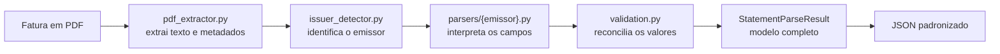

# Fatura Parser

Aplicação Python que extrai dados de faturas de cartão em PDF e produz um JSON
padronizado, validado e pronto para alimentar dashboards de gastos.

Este repositório contém o primeiro MVP do motor de importação. A interface web
e o dashboard serão construídos em etapas futuras sobre o contrato JSON já
definido.

## Estado atual

| Emissor | Detecção | Extração completa |
| --- | --- | --- |
| Inter | Sim | Sim |
| Mercado Pago | Sim | Sim |
| Itaú | Sim | Sim |

O parser do Inter atualmente extrai:

- Informações gerais da fatura, como vencimento, total e pagamento mínimo.
- Resumos separados para cada cartão encontrado.
- Transações, valores, datas, parcelas e tipos contábeis.
- Validação entre o total declarado e a soma das transações.
- Metadados técnicos para identificar a origem do JSON.

O parser do Mercado Pago entrega o mesmo contrato, incluindo pagamentos gerais
sem cartão e inferência do ano quando a transação informa apenas dia e mês.

O parser do Itaú também considera o saldo anterior e os pagamentos na
reconciliação do total. Como seus lançamentos aparecem em duas colunas, ele usa
as coordenadas das palavras no PDF para preservar a ordem e separar os blocos.

## Como o processamento funciona


```mermaid
flowchart LR
    PDF["Fatura em PDF"] --> EXTRACT["pdf_extractor.py<br/>extrai texto e metadados"]
    EXTRACT --> DETECT["issuer_detector.py<br/>identifica o emissor"]
    DETECT --> PARSER["parsers/{emissor}.py<br/>interpreta os campos"]
    PARSER --> VALIDATE["validation.py<br/>reconcilia os valores"]
    VALIDATE --> RESULT["StatementParseResult<br/>modelo completo"]
    RESULT --> JSON["JSON padronizado"]
```

O `statement_parser.py` coordena essas etapas. Os Models do Pydantic garantem
que cada bloco respeite o formato esperado antes da geração do JSON.

## Requisitos

- Python 3.12 ou superior.
- PowerShell para executar os exemplos abaixo no Windows.
- `uv` recomendado para instalar exatamente as dependências travadas.

## Preparando o ambiente

Na raiz do projeto:

```powershell
py -3.12 -m venv .venv
uv pip install --python .venv\Scripts\python.exe --require-hashes -r requirements-dev.lock
uv pip install --python .venv\Scripts\python.exe --no-deps -e .
```

O primeiro comando cria um ambiente isolado. O segundo instala as versões e os
hashes registrados no lockfile. O terceiro instala este projeto em modo
editável, permitindo alterar o código sem reinstalá-lo a cada mudança.

## Gerando o JSON

Coloque a fatura real dentro de `samples/private/`. Essa pasta é ignorada pelo
Git.

```powershell
.venv\Scripts\fatura-parser.exe samples/private/inter.pdf
```

Por padrão, o JSON será criado em `output/inter.json`. Para escolher outro
caminho:

```powershell
.venv\Scripts\fatura-parser.exe samples/private/inter.pdf --output output/minha-fatura.json
```

Para um PDF protegido, solicite a senha de forma oculta:

```powershell
.venv\Scripts\fatura-parser.exe samples/private/inter.pdf --password-prompt
```

O exportador bloqueia por padrão resultados com divergências ou avisos. A opção
`--allow-warnings` existe somente para gerar um arquivo destinado à revisão
manual.

## Preparando o banco de dados

Crie ou atualize as tabelas antes de iniciar a API:

```powershell
.venv\Scripts\python.exe -m alembic upgrade head
```

O Alembic executa somente as migrations que ainda não foram aplicadas. Por isso,
esse comando também será usado no futuro sempre que o esquema do banco mudar.

Crie o primeiro usuário local depois de aplicar as migrations:

```powershell
.venv\Scripts\fatura-parser-create-user.exe chris@example.com
```

A senha é solicitada e confirmada por entradas ocultas. Ela precisa ter entre 15
e 128 caracteres e não é aceita como argumento do comando, evitando que apareça
no histórico do terminal. Apenas seu hash Argon2id é armazenado no banco.

## Executando a API local

Inicie o servidor de desenvolvimento na raiz do projeto:

```powershell
.venv\Scripts\python.exe -m uvicorn fatura_parser.api:app --reload
```

A API ficará disponível em `http://127.0.0.1:8000`. Para confirmar que o
processo está respondendo, acesse `http://127.0.0.1:8000/health`. A documentação
interativa gerada pelo FastAPI fica em `http://127.0.0.1:8000/docs`.

As migrations e a aplicação usam o banco SQLite local em
`data/fatura_parser.db`. O diretório `data/` e arquivos SQLite são ignorados
pelo Git porque contêm usuários e, futuramente, informações financeiras.

## Inspecionando a extração

O inspetor mostra informações técnicas e oculta os dados financeiros por
padrão:

```powershell
.venv\Scripts\python.exe examples/inspect_pdf.py samples/private/inter.pdf
```

Para exibir o conteúdo completo, incluindo uma página específica:

```powershell
.venv\Scripts\python.exe examples/inspect_pdf.py samples/private/inter.pdf --show-sensitive-data --page 4
```

Use o modo sensível apenas em um terminal privado. A saída pode permanecer no
histórico, em logs ou em capturas de tela.

## Executando os testes

```powershell
.venv\Scripts\python.exe -m unittest discover -s tests -v
```

Os testes criam PDFs e documentos sintéticos em memória. Nenhuma fatura real é
necessária ou deve ser adicionada às fixtures.

## Estrutura do repositório

| Caminho | Responsabilidade |
| --- | --- |
| `src/fatura_parser/` | Código principal da biblioteca e da CLI. |
| `src/fatura_parser/api/` | Aplicação HTTP criada com FastAPI. |
| `src/fatura_parser/auth/` | Regras de e-mail, senha e usuários locais. |
| `src/fatura_parser/database/` | Conexão, sessões e modelos persistidos no SQLite. |
| `migrations/` | Histórico versionado das alterações no esquema do banco. |
| `src/fatura_parser/parsers/` | Regras específicas de cada emissor. |
| `tests/` | Testes automatizados com dados sintéticos. |
| `examples/` | Inspetor didático e exemplo do JSON final. |
| `docs/` | Contrato JSON e gerenciamento de dependências. |
| `data/` | Banco local privado, sempre ignorado pelo Git. |
| `samples/private/` | PDFs reais locais, sempre ignorados pelo Git. |
| `output/` | JSONs gerados localmente, também ignorados pelo Git. |

## Segurança e privacidade

- PDFs são ignorados globalmente pelo `.gitignore`.
- PDFs reais e JSONs gerados não devem ser enviados ao GitHub.
- Senhas de PDFs são solicitadas por uma entrada oculta.
- A quantidade e o tamanho das páginas processadas possuem limites.
- A gravação do JSON é atômica para evitar arquivos parciais.
- Dependências são travadas com versões e hashes e podem ser auditadas.
- Dados completos só são mostrados pelo inspetor após autorização explícita.
- Senhas são normalizadas e protegidas com hash Argon2id e salt aleatório.
- A criação local solicita a senha de forma oculta e exige confirmação.
- Sessões usam tokens aleatórios; somente seus hashes são persistidos.

Antes de qualquer commit, confira `git status` e confirme que nenhum documento
financeiro está listado.

## Documentação complementar

- [Contrato do JSON](docs/json-contract.md)
- [Dependências e auditoria de segurança](docs/dependencies.md)
- [Uso seguro das faturas locais](samples/README.md)

## Próximas etapas

- Ampliar as fixtures sintéticas para novas versões de fatura.
- Expor login, logout e usuário atual pela API com cookies seguros.
- Persistir faturas, cartões e transações no banco local.
- Criar o dashboard com visualização por cartão, banco e período.
